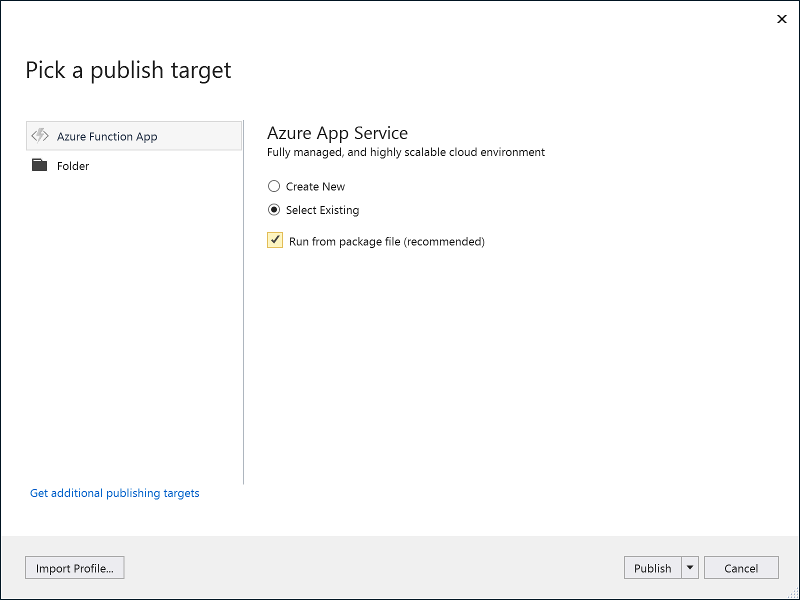

# Lab 4 - Deploying Azure Functions

In this lab you will learn how to deploy your Function App from your development machine to Azure. You are going to start by doing a manual deployment from the Command-Line Interface and progress to Visual Studio Team Services using a release pipeline.

Goals for this lab: 
- [Deploy your Function App manually using VS2017](#1)
- [Deploy your Function App manually using Azure Functions Core Tools and Azure CLI](#2)
- [Configuring application settings from Azure CLI](#3)
- [Building your Function App in VSTS](#4)
- [Releasing your Function App to Azure](#5)
- [Provisioning a Function App using Azure Resource Manager](#6)

## <a name="1"></a>1. Deploy your Function App manually using VS2017

Let's start with simply publishing the FunctionApp to Azure from Visual Studio 2017.

Right-click on the FunctionApp and select `Publish..`.

You will see this screen:

 
- Select **Azure Function App** on the left.
- Select **Select Existing** since you will reuse the FunctionApp which was created in Lab 1.
- Select **Run from package file**
- Click **Publish**. 

In the next screen, select the subscription you've used to create the FunctionApp in Azure (in Lab 1), click on the FunctionApp name under the corresponding resource group and click OK. Now a publishing pofile is created and the FunctionApp is published to Azure.

> Have a look at the publishing profile in Visual Studio (pubxml file) to familiarize yourself with the content of this file.
>
> Browse to the FunctionApp in Azure and observe the published functions in the FunctionApp.

## <a name="2"></a>2. Deploy your Function App manually using Azure Functions Core Tools and Azure CLI

Use the Azure Function Core tools and the Azure CLI to deploy the Function App you created in the previous lab. Open a console windows with administrator privileges and check whether the CLIs are installed.
```
func --help
az --help
```
If the CLIs are available, you are good to continue. Otherwise, refer to [Lab 0](Lab0-GettingStarted.md) to install the Azure Function Core tools.

Change the current directory of your command prompt to the folder of your Visual Studio FunctionApp project.

### Azure Login & Subscriptions

Ensure you are logged in to use the Azure CLI:
```
az login
```
Follow the instructions to complete the login.

Ensure the correct Azure subscription is active. You can list and switch subscriptions with these commands:
```
az account list
az account set --subscription <subscriptionguid>
```

### Publish the FunctionApp

Once the correct subscription is set, you can deploy your application to the Function App in Azure using:
```
func azure functionapp publish <FunctionsWorkshop2018Name>
```
> Observe in the CLI console what this command is doing.  

### Verification in Azure

Open the Azure portal and verify that the app was published successfully. Navigate to the FunctionApp just published and check whether it is functioning correctly: 

> Start by verifying the DumpHeadersFunction from the portal. 
> 
> Does it work, and if so, why? 
> Fix your application if this function doesn't function correctly.

Proceed to the LinkSourceExtractor function. Check the resource group of your Function App to find the name of the Azure Storage resource. Drop a message in the queue and check if it is being processed. 

> Before continuing, reason about what could be wrong.

You may have come to the conclusion that the application settings are not complete. The missing settings need to be deployed and should have the correct values.
Use the following command to retrieve all settings from the specified Function App.

```
func azure functionapp fetch-app-settings FunctionsWorkshop2018
```

This will write the settings from the portal to your ```local.settings.json``` file in the root of your FunctionApp folder. It will append the existing local settings.

Verify that settings file still has the following settings: 
- ```azurefunctions-queues```
- ```azurefunctions-tables```
- ```azurefunctions-blobs```

Copy the value of ```AzureWebJobsStorage``` to each of these settings and save your edits.

Next, publish your application again, using the flag to include the local settings, or just the local settings. Use the commands of your choice:

```
func azure functionapp publish <FunctionsWorkshop2018Name> --publish-local-settings
func azure functionapp publish <FunctionsWorkshop2018Name> --publish-settings-only
```

Verify that all functions are working now.

## <a name="3"></a>3. Configuring application settings from Azure CLI

In the previous part of this lab you should have noticed that the published application requires certain settings to be deployed. The Functions CLI does offer a way to publish all settings, but it requires downloading all settings and changes to a file. 
There in another way to publish settings and it uses the Azure CLI. This approach is more suitable for the next part of this lab to create an automated release pipeline.

You can use the Azure CLI to retrieve a list of application settings of the Function App, and delete, change or create these. 

```
az functionapp config appsettings list --name FunctionsWorkshop2018 --resource-group FunctionsWorkshop2018
```
This command will list the current settings of an Function App.
Next, run the command:

```
az functionapp config appsettings set --settings FUNCTIONS_EXTENSION_VERSION=~2 azurefunctions-queues="..." azurefunctions-tables="..." azurefunctions-blobs="..."  --name <FunctionsWorkshop2018Name> --resource-group <FunctionsWorkshop2018ResourceGroupName>
```
where the ... elipsis need to be replaced with the value of the connection string to the Azure Storage resource like before.

The individual settings are declared as space separated ```key=value``` pairs. This will change the application settings for the current runtime version to be 2.0 beta (later to be ~2) and also set the other settings.

Check that the settings are all present now in your Function App and that it still functions correctly.

## <a name="4"></a>4. Building your Function App in VSTS

With the application deployed manually including correct settings, you are in good shape to create a pipeline to automate build and release. 
Open the Visual Studio Team Services (VSTS) portal and navigate to the team project for the workshop.
You should see the Git repository under Code, Files. Navigate to the ```Build and Release``` tab and go to Builds.
Choose to create a new Build definition and pick the repository where your source is located. This should be under VSTS Git, but you might have chosen a different location for your code repository. For VSTS Git, pick the team project, Repository and branch to checkout for a build. Choose the ```ASP.NET Core``` template.


Inspect each of the steps. To make this pipeline work you need to change some settings of the ```Publish``` task. Uncheck the ```Publish Web Projects``` checkbox and change the ```Path to the project(s)``` to be that of your Function App project, e.g. ```**/FunctionsWorkshop2018.csproj```.

After these changes you should be able to perform a successful build. To verify queue a new build from the ```Queue``` button at the top. 

## <a name="5"></a>5. Releasing your Function App to Azure

After a successful build you probably want to release your Function App to Azure. 

Create a new Release pipeline from the Releases tab. Choose the ```Azure App Service Deployment``` template, name your environment ```Production``` and find that your pipeline looks like similar to this:


Navigate to the Tasks of the pipeline by clicking the link in the Production environment that reads ```1 phase, 1 task```. At the top of the left pane there will be a block with the name of the environment. Once selected, you should see the most important settings to the right.
You need to select your own Azure subscription in the corresponding dropdown. If you haven't created an Azure Resource Manager service endpoint yet, you need to click the ```Manage``` link and create such a service endpoint. After that you can refresh the dropdown with the Refresh button and select your subscription. Next, select the ```Function App``` as the application type and your previously created Function App from the bottom dropdown.

Save the Release pipeline and queue a new release from the successful build you did previously. Verify that the release completes without errors and that the Function App works correctly.

You will need to be able to set the Application Settings of the Web App that hosts your Function App. You already did this from the Azure CLI before. This can also be done from a VSTS task during release.
Add a new ```Azure CLI``` task to the pipeline and point it to the same Azure subscription. Switch the script location to be inline script. Use the following inline script in this task:

```
az functionapp config appsettings set --settings FUNCTIONS_EXTENSION_VERSION=beta azurefunctions-queues=$(StorageConnection) azurefunctions-tables=$(StorageConnection) azurefunctions-blobs=$(StorageConnection) --name FunctionsWorkshop2018 --resource-group FunctionsWorkshop2018
```

and create a variable in the Release pipeline tab called ```Variables```. The variable should be named ```StorageConnection``` and have the same value as you assigned before using the Azure CLI script.

Save your Release pipeline and create a new release. Check that everything get deployed successfully and fix any errors.

## <a name="6"></a>6. Provisioning a Function App using Azure Resource Manager

In this final part you are going to provision the Function App from a VSTS release pipeline. The preferred mechanism is to use Azure Resource Manager (ARM) templates. 
Since you already have an existing Azure Function App you can get the ARM template from the Azure portal. Go to your resource group where you deployed the Function App originally. 

At the top of the Overview of the resource group you should find a link underneath a section called ```Deployments```. 


Follow the link and check the various deployments that were performed. This might include your release pipeline deployments. 


Select the very first deployment and a new blade will open. You should see the template for this deployment with around 4 parameters and 3 resources. On the top menu, click the Download link and store the zip file in a known location.

Extract the files from the zip file to the root of your solution and add them as existing files in a solution folder called ```deployments```. Rename the files to be ```AzureFunction.json``` and ```AzureFunction.parameters.json```.

In the Azure portal you can create a new resource group to test the ARM template deployment. After creating the resource group you can open a console window and run the following command using the Azure CLI:
```
az group deployment create --name CLIDeployment --resource-group ServerlessFunctions --template-file AzureFunction.json --parameters @AzureFunction.parameters.json
```

Make sure to change the value for the resource group to the test group you created a moment ago. If the deployment succeeds, continue with the next step after checking in the changes.

Next, go to your VSTS Team project and create a new release pipeline. Start with an empty pipeline. Name the environment ```Acceptance```. Add an artifact for the pipeling and pick Git with your code repository and master branch. Switch to the Tasks tab and add a ```Azure Resource Group Deployment``` to the empty list of tasks. Configure the Azure subscription and set the correct resource group. In the ```Template``` and ```Template parameters``` fields click the elipsis and select the ARM template and parameters file respectively.

Save the release pipeline and start a new release. Verify that the deployment works and fix any errors. After successful deployment, you can use your deployment pipeline to release your Function App to the newly provisioned ARM resource.

## Wrapup
In this lab you have created a VSTS build and release pipeline to automate deploying your Function App in Azure. You also used Azure CLI to deploy individual application settings. Finally, you have created provisioning pipeline to automate creation of the Azure resources for your Function App.

Continue with [Lab 5 - Securing your Azure Functions](Lab5-Securing.md).


